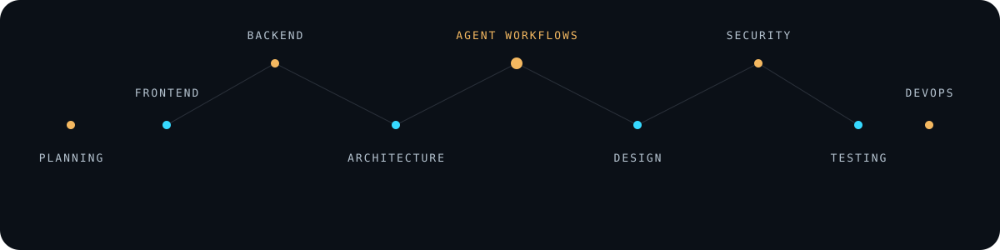

# Prats Skill Atlas

<p align="center">
  
</p>

<p align="center">
  <strong>A navigable constellation of global skills for Claude, Codex, and shared agents.</strong><br>
  Clone once. Install everywhere. Keep the runtime clean.
</p>

<p align="center">
  <a href="https://github.com/peterish8/prats-skill-atlas"></a>
  <a href="https://github.com/peterish8/prats-skill-atlas/tree/main/.claude"></a>
  <a href="https://github.com/peterish8/prats-skill-atlas/tree/main/.codex"></a>
  <a href="https://github.com/peterish8/prats-skill-atlas/blob/main/LICENSE"></a>
</p>

<p align="center">
  
</p>

## The idea

Skill collections grow like galaxies: useful stars arrive from different systems, then become hard to find. **Prats Skill Atlas** gives that collection a clear map.

This public repository packages the global skill trees from Claude, Codex, and shared agents into one cloneable home. The source layout is organized for humans. The installers flatten it back to the runtime layout each tool expects.

## First-time setup

Hand this repository to Claude or Codex and the root agent instructions will route the conversation through [`ONBOARDING.md`](ONBOARDING.md). The agent inventories your project, asks 12 focused questions, proposes a small skill plan, shows what it is leaving out, and waits for approval before installing anything.

The default is selective setup. Your friend does not need to explain this workflow manually, and no one gets the full atlas unless they explicitly choose it.

## What is inside

| Runtime tree | Packages | Purpose |
| --- | ---: | --- |
| [`.claude/skills`](.claude/skills) | 378 | Claude-compatible skill packages |
| [`.codex/skills`](.codex/skills) | 278 | Codex-compatible skill packages |
| [`.agents/skills`](.agents/skills) | 333 | Shared agent skill packages |
| **Unique skill names** | **509** | Deduplicated collection across all trees |

Every package keeps its own `SKILL.md`, references, scripts, and practical assets where they are safe to redistribute. Categories and subcategories make the collection easy to scan:

- `planning/project-planning`
- `product-growth/{user-research,funnel-and-activation,experimentation,monetization,retention-and-referral,measurement-and-ops,ethical-growth,orchestration}`
- `architecture/system-design`
- `frontend/web-ui`
- `backend/apis-and-platforms`
- `design/visual-and-motion`
- `agent-workflows/coordination`
- `security/{appsec-and-privacy,reverse-engineering}`
- `testing/qa-and-verification`
- `devops/delivery-and-tooling`
- `docs/writing-and-specs`
- `research-data/research-seo-and-content`
- `integrations/platform-tools`
- `mobile/native-and-cross-platform`
- `specialists/domain-workflows`
- `tools-utilities/general-purpose`

See the complete map in [`catalog/skills.md`](catalog/skills.md).

## Product Growth system

The Atlas includes a source-backed Product Growth system with 25 independently installable skills. The orchestrator selects only the focused skills needed for the current decision:

```text
product-growth/
|-- user-research/                 3 skills
|-- funnel-and-activation/         3 skills
|-- experimentation/               4 skills
|-- monetization/                  4 skills
|-- retention-and-referral/        3 skills
|-- measurement-and-ops/           4 skills
|-- ethical-growth/                 3 skills
`-- orchestration/
    `-- product-growth-experimentation
```

It covers the complete loop from user evidence and acquisition intent through activation, trustworthy A/B tests, pricing and paywalls, retention, referral, instrumentation, decisions, privacy, accessibility, and dark-pattern prevention. Start with [`product-growth-experimentation`](.agents/skills/product-growth/orchestration/product-growth-experimentation/SKILL.md) for an end-to-end problem or choose a narrower package directly.

A minimal cross-runtime manifest is available at [`examples/product-growth-selection.example.json`](examples/product-growth-selection.example.json).

## Guarded reverse-security router

[`reverse-skill-router`](.agents/skills/security/reverse-engineering/reverse-skill-router/SKILL.md) adapts the upstream [`zhaoxuya520/reverse-skill`](https://github.com/zhaoxuya520/reverse-skill) router for authorized reverse engineering, CTF, malware analysis, and defensive security work. Its explicit R0–R3 command policy allows passive and bounded local work while requiring a clear yes/no permission immediately before risky commands, network activity, tool installation, dynamic execution, device changes, exploitation, or destructive actions.

The Atlas carries the lightweight guarded adapter and upstream provenance, not three copies of the upstream executable and payload corpus. A pinned shared checkout can serve Claude, Codex, and Agents without silently executing its bootstrap scripts. Use the [`reverse-skill` selection example](examples/reverse-skill-selection.example.json) to install only this adapter.

## Install the atlas

### Windows PowerShell

```powershell
git clone https://github.com/peterish8/prats-skill-atlas.git
cd prats-skill-atlas
.\install.ps1 -All
```

Install only the runtime tree you need:

```powershell
.\install.ps1 -Claude
.\install.ps1 -Codex
.\install.ps1 -Agents
```

### macOS, Linux, or WSL

```bash
git clone https://github.com/peterish8/prats-skill-atlas.git
cd prats-skill-atlas
./install.sh all
```

The installers are copy-only. They create missing directories and overwrite same-named packages, but never delete unrelated local skills.

## The repository map

```text
prats-skill-atlas/
|-- .claude/skills/<category>/<subcategory>/<skill-name>/SKILL.md
|-- .codex/skills/<category>/<subcategory>/<skill-name>/SKILL.md
|-- .agents/skills/<category>/<subcategory>/<skill-name>/SKILL.md
|-- assets/
|   |-- prats-skill-atlas-hero.svg
|   `-- atlas-network.svg
|-- catalog/
|   |-- skills.json
|   |-- skills.md
|   `-- categories/<category>--<subcategory>.md
|-- scripts/
|   |-- build-catalog.ps1
|   |-- organize-runtime-trees.ps1
|   `-- validate.ps1
|-- install.ps1
|-- install.sh
`-- NOTICE.md
```

The category folders are the browsing layer. `install.ps1` and `install.sh` intentionally flatten packages into the user runtime roots, so Claude and Codex continue to discover skills by package name.

For an approved selection, the agent creates a reviewable `.prats/selection.json` manifest and installs only those exact package names:

```powershell
.\install.ps1 -Manifest .\.prats\selection.json
```

## Catalog and maintenance

- [`catalog/skills.md`](catalog/skills.md): human-readable index of every package
- [`catalog/skills.json`](catalog/skills.json): machine-readable package metadata
- [`catalog/categories/`](catalog/categories/): focused pages for each category
- [`catalog/README.md`](catalog/README.md): category rules and source notes
- [`ONBOARDING.md`](ONBOARDING.md): the 12-question interview and selection contract

After adding or syncing packages:

```powershell
.\scripts\organize-runtime-trees.ps1
.\scripts\build-catalog.ps1
.\scripts\validate.ps1
```

The organizer applies deterministic name-based rules to new flat packages. The catalog records the actual category path. Validation checks all three runtime trees and every required `SKILL.md`.

## Motion, with a quiet fallback

The atlas artwork is built as inline-friendly SVG, not a screenshot. Orbit lines, signal pulses, and constellation points animate in browsers that support SVG motion. The moving layers are marked with `.motion` and disappear when `prefers-reduced-motion: reduce` is enabled. The labels and hierarchy remain readable in the still frame.

## Source and license notes

This is a local skill mirror and packaging project. Generated dependencies and machine-specific artifacts are intentionally excluded, including `node_modules`, `.venv`, Playwright browser binaries, `dist`, `.git`, bytecode, native binaries, and similar build output.

Individual skill packages may have their own authorship and license terms. Read [`NOTICE.md`](NOTICE.md) before redistributing or modifying a specific package.

## Make it yours

Fork the atlas, add your own skill constellation, regenerate the catalog, and keep the runtime roots clean. If you build a useful category or compatibility improvement, open a pull request with the validation output included.
